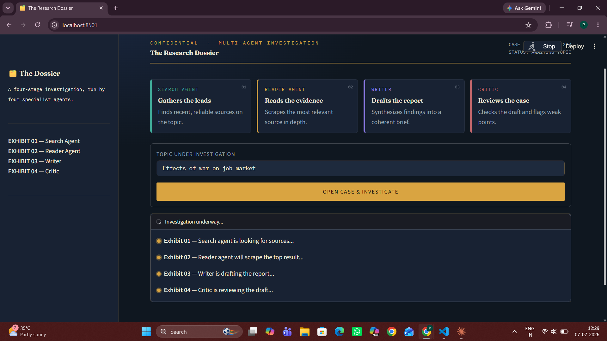
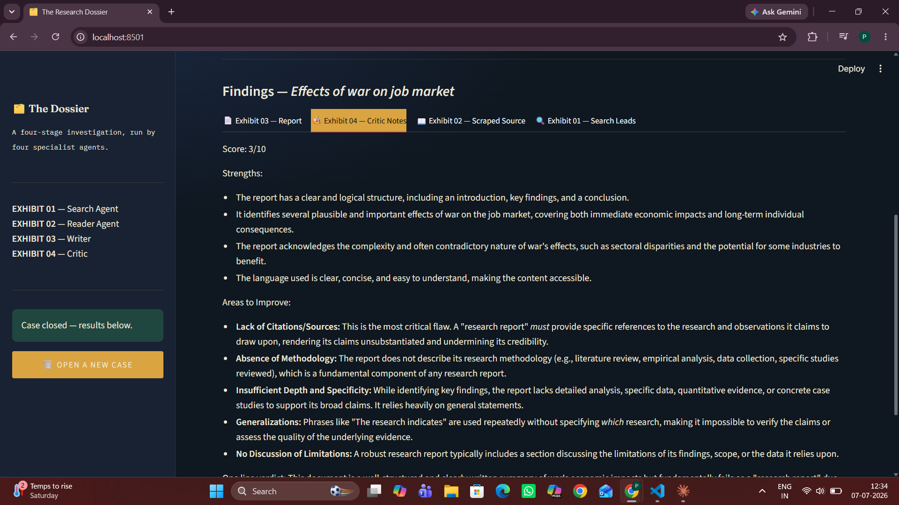

# Multi-Agent Research System

A dynamic, full-stack multi-agent research pipeline built using **LangGraph**, **LangChain**, and **Streamlit**. Powered by Google's **Gemini 2.5 Flash**, this platform automates the process of executing technical topic lookups, analyzing real-time indicators, and drafting comprehensive intelligence dossiers.

## 🚀 Live Demo
Check out the live application here: **[(https://the-research-dossier-mk3n2chbvs9xokwxr8x4qq.streamlit.app/)]**

---

## 🏗️ System Architecture

The platform breaks down complex research workflows into specialized, conversational agents that execute sequentially via an stateful graph pipeline:

*   **Search Agent:** Queries live sources using advanced search tools to aggregate fresh, relevant data.
*   **Reader Agent:** Processes raw search payloads, filters out noise, and extracts core contextual knowledge blocks.
*   **Writer Chain:** Synthesizes extracted data points into a cohesive, structured, and professional narrative.
*   **Critic Chain:** Reviews the drafted report against strict quality guidelines, ensuring technical accuracy and factual compliance.

---
| 1. Input UI | 2. Agent Execution | 3. Final Report |
| :---: | :---: | :---: |
|  |  |  |

## 📁 Project Map

```text
├── .env                  # Local environment configurations (ignored by git)
├── .gitignore            # Spec for tracking exclusions (.venv, __pycache__, .env)
├── agents.py             # Logic layer configuring the ChatGoogleGenerativeAI agents
├── app.py                # Presentation layer / Streamlit interactive interface
├── pipeline.py           # Core orchestrator managing LangGraph processing nodes
├── requirements.txt      # Automated deployment engine configuration manifest
└── tools.py              # Custom utilities executing technical API lookups```
## 📱 Application Interface

| 1. Input UI | 2. Agent Execution | 3. Final Report |
| :---: | :---: | :---: |
|  |  |  |
